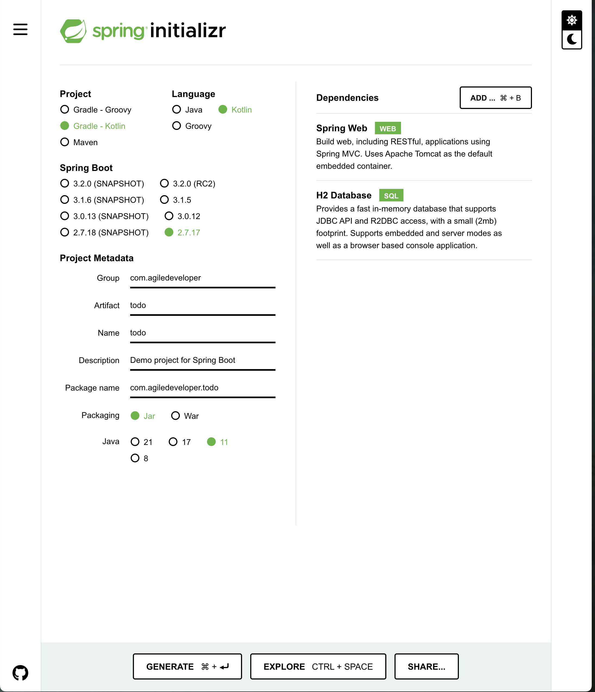

# Getting Started

服务端构建
./gradlew build

服务端运行
java -jar build/libs/todo-0.0.1-SNAPSHOT.jar

服务端终止
sudo lsof -n -i :8080 | grep LISTEN
kill -9 PID
或者 control + c

客户端请求
curl -w "\n" http://localhost:8080/task

